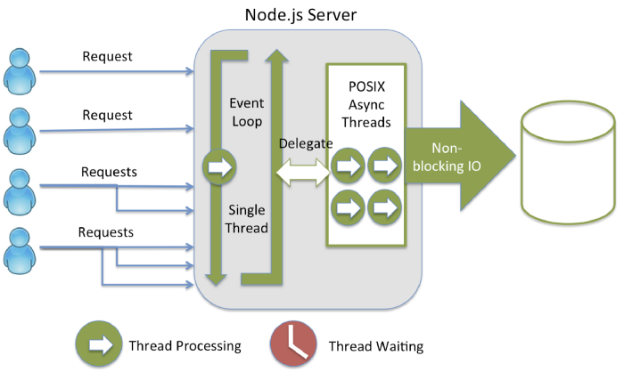
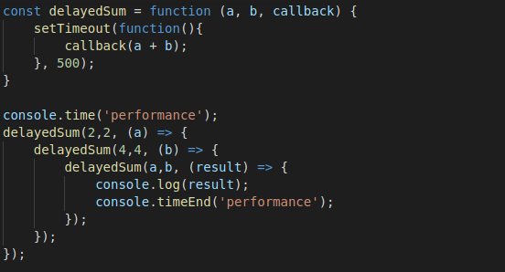
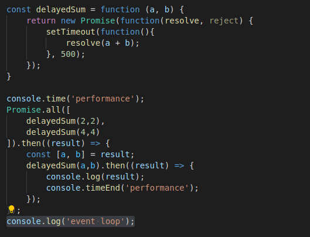
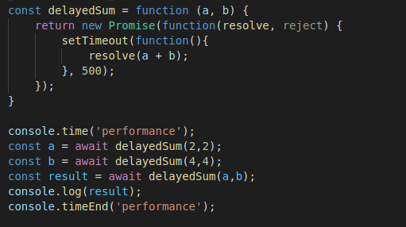
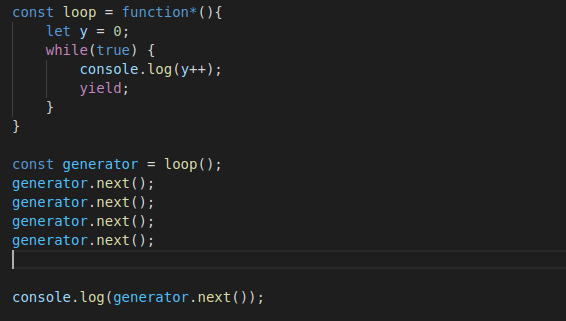
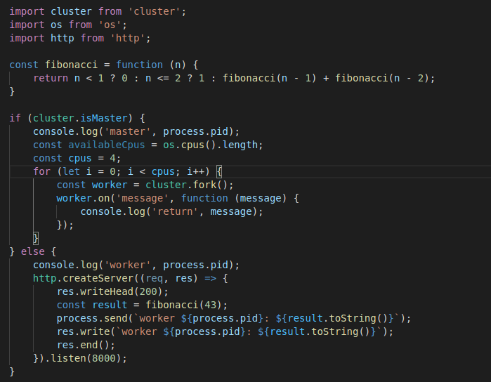
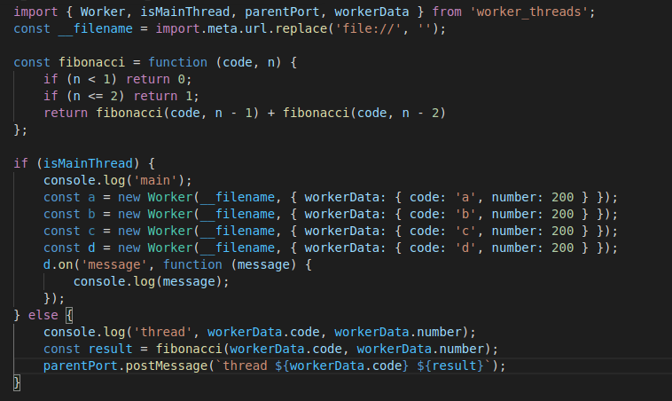

# nodejssync

The goal of this project is demonstrate how implements **callback**, **promise**, **async/await**, **generator** and ** **

## ref
https://www.youtube.com/watch?v=M6wLBpzSvqw&feature=emb_logo

## how to create - init
> $ yarn init

## how to install ApacheBench on ubuntu 20.04
> $ apt-get update
> $ apt-get install apache2-utils

## callback

## promise

## async/await

## generator

## cluster

## worker threads
